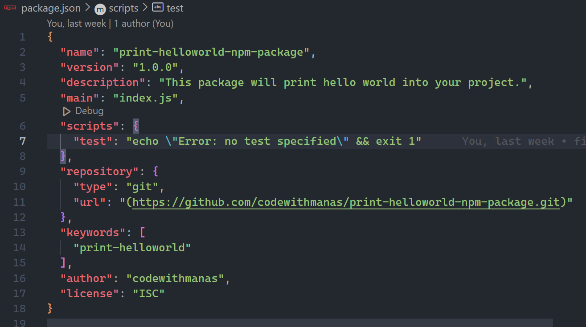
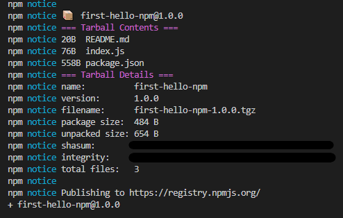

# How to create and publish npm package
**Package Name -** print-helloworld-npm-package
**How to install -** `npm i print-helloworld-npm-package`


## Step-1:
- Go to the [NPM registry](https://www.npmjs.com/) and run a search
- Choose a unique name. (mynpmpackage is treated same as my-npm-package)
- Let say we found a unique name and this is the one

## Step-2:
- Create a new folder/directory and name this that unique name, for our case it is `my-npm-package`
- Make sure your system has [NodeJS](https://nodejs.org/en/download/) installed. Check by running the command `node -v` and if not installed, install it.

## Step-3:
- Run `git init` command inside project directory to track the changes using version control

## Step-4:
- Initialize NPM in the project by running `npm init` command
- This will create a `package.json` file. You will get prompts to provide the following information:


## Step-5:
- In the project folder create a file named `index.js`, where all the logics will be written.
- For this example, here is the code that returns a string "Hello World"
```javascript
function printHelloWorld(){
    return "Hello World!";
}

module.exports = printHelloWorld;
```

## Step-6:
- To publish your package on the NPM registry, you need to have an account. If you don't have an account, visit the [NPM sign up page](https://www.npmjs.com/signup) to create one.
- After creating the account, open your terminal and run the following command in the root of your package:
```javascript
npm login
```
- You will get a prompt to enter your username and password. If login is successful, you should see a message like this:

Logged in as `<your-username>` on https://registry.npmjs.org/.

## Step-7:
You can now run the following command to publish your package on the NPM registry:
```javascript
npm publish
```
If all goes well, you should get results similar to the screenshot below:


If you have been following along, then congratulations! You just published your first NPM package. 

